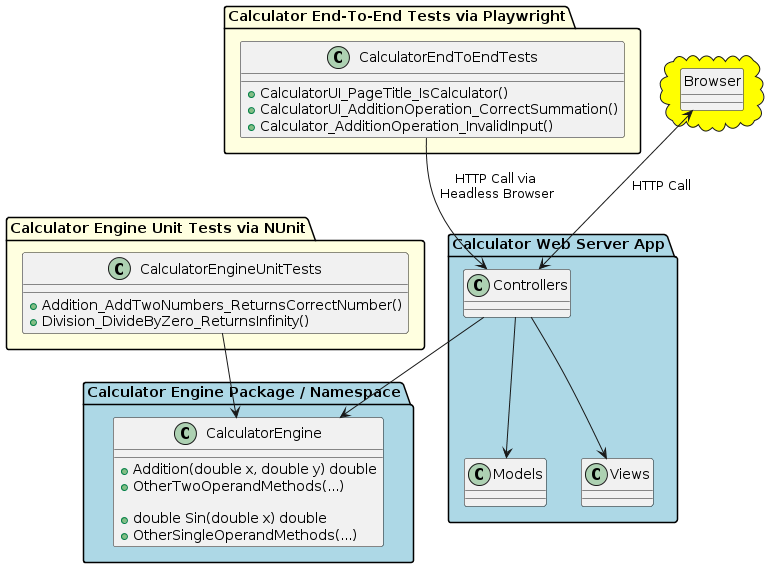
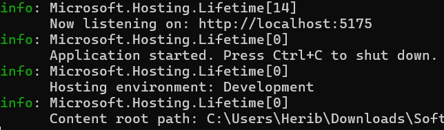
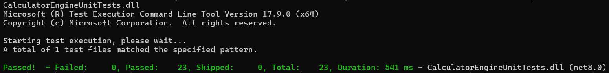
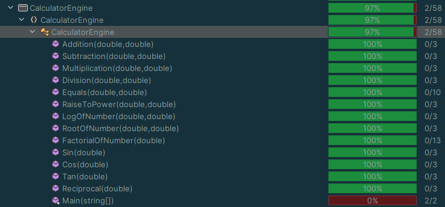
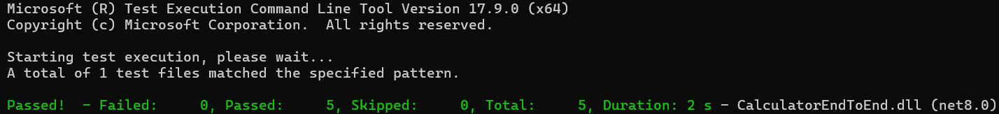

# KSU SWE 3643 Software Testing and Quality Assurance Semester Project: Web-Based Calculator
This Repository contains source code for a ASP.NET MVC web-based calculator project. The applications uses NUnit and Playwright for testing. 

## Table of Contents
- [Environment](#environment)
- [Executing the Web Application](#executing-the-web-application)
- [Executing Unit Tests](#executing-unit-tests)
- [Reviewing Unit Test Coverage](#reviewing-unit-tests-coverage)
- [Executing End-To-End Tests](#executing-end-to-end-tests)
- [Final Video Presentation](#final-video-presentation)

## Team Members
Heriberto Contreras

## Architechture
There are four projects all contained within one solution. The projects are listed below
- CalculatorEngine: Here lies the logic of the calculator. 
- CalculatorEngineUnitTests: Unit tests dedicated for the calculator's engine.
- CalculatorWebAppServer: This project hosts the ASP.NET MVC application using cshtml, css, and C#.
- CalculatorEndToEndTests: Playwright scripts are placed here.

## Environment
This application can be ran on Windows 10+, Mac OS, and Linux Environments. This application has only been tested for Windows 11 but the environment can be set up for the operating systems listed above. I will be giving intallation examples for windows users.

### Environment preparation steps
1. [Ensure that you install .NET SDK 8.0 for your desired operating system] (https://dotnet.microsoft.com/en-us/download/dotnet/8.0)
2. [Install NUnit using a package manager such as NuGet or a manual installation]

### Playwright Environment Set-Up
For this example I will be demonstrating an playwright installation for Windows 10+. For other operating systems I will refer you to the playwright installation guide. (https://playwright.dev/docs/intro)
1. Install Powershell 7 for Windows. (https://learn.microsoft.com/en-us/powershell/scripting/install/installing-powershell-on-windows?view=powershell-7.4)
2. Use the command `dotnet tool install --global Microsoft.Playwright.CTI` in your home directory
3. Navigate to the folder/directory `CalculatorEndToEndTests` and run `playwright install`.

## Executing the Web Application
To execute the application:
1. Open the terminal and navigate to the `CalculatorWebServerApp` folder in the solution folder/directory.
2. Once in the folder use the command `dotnet` run to start the web server.
3. The terminal output should look like this.

5. Copy the url shown in the terminal and paste it into a browser.

## Executing Unit Tests
1. Navigate to the `CalculatorEngineUnitTests` folder/directory
2. Once in this folder/directory, navigate to through the `\bin\Debug\net8.0\`
3. Inside the `net8.0` folder/directory run the command `dotnet test CalculatorEngineUnitTests.dll`
4. The terminal should output the results of all 23 unit tests

## Reviewing Unit Tests Coverage
The Calculator logic located in the CalculatorEngine.cs file has full path and statement coverage.

## Executing End-To-End Tests
Make sure that the web server is up and running.
1. Open up a different terminal/powershell. (This ensures that the web server is still running)
2. Navigate to the `CalculatorEndToEndTests` folder/directory.
3. Similar to executing the Unit tests, navigate through the `\bin\Debug\net8.0\`
4. Inside the `net8.0` folder/directory run the command `dotnet test CalculatorEndToEndTest.dll`
5. The terminal should output the results of the playwright scripts.

## Final Video Presentation

